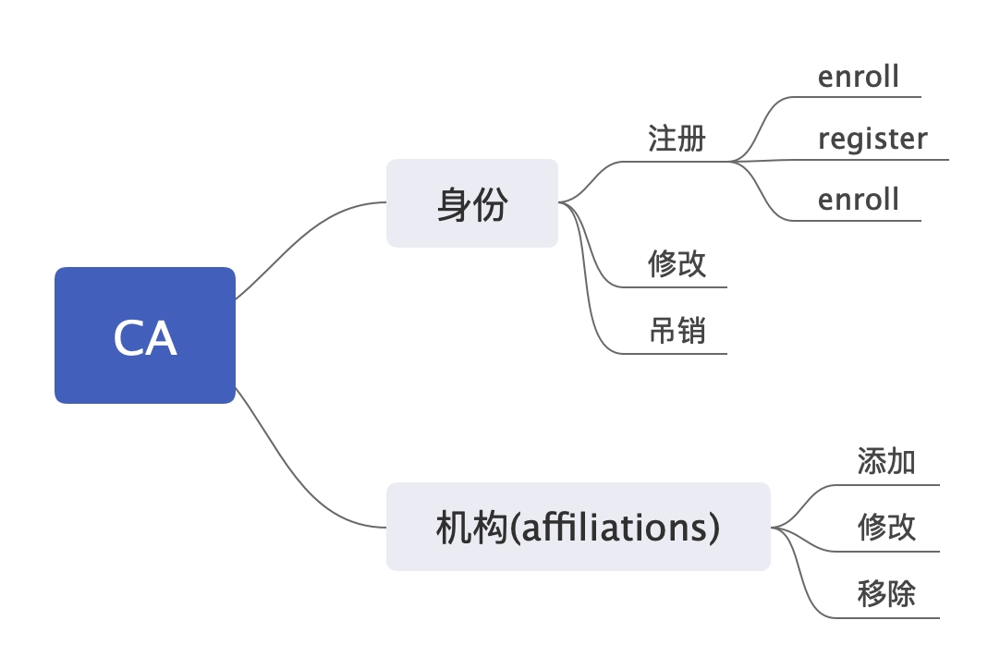
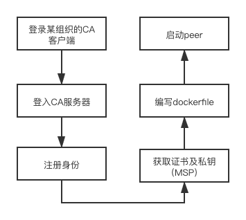

## CA

加入Fabric联盟链的计算机结点和用户都必须要经过注册并获得CA颁发的证书，才能在联盟链中操作。

Fabric Server端由一个服务器集群组成，以树形架构组织CA Server节点，包含一个Root 节点和多个中间节点。每个CA要么是根CA，要么是中间CA。每个中间CA都有一个父CA，它要么是根CA，要么是另一个中间CA。

### CA功能

#### 注册身份（添加一个节点）

* enroll 连接CA服务器

  使用一个引导身份(bootstrap identity)登记ca server

* register注册一个新的身份

  指定注册名字id，隶属关系，属性

  返回一个密码enrollment **secret**

* enroll 获取私钥和证书

  使用名字id和密码获取私钥和证书 

#### 修改身份

比如当前CA服务器有org1.peer、org1.client、org1.admin三种角色，那就可以将节点的角色修改为其中的一种，两种或三种。

#### 吊销身份或证书

* 吊销证书使该身份下的所有证书都失效
* 吊销证书是一个证书失效

把吊销证书放到吊销证书列表中。验证的时候，查看待验证证书是否吊销证书列表中。

#### 机构（affiliations）的添加、修改、删除

* 添加机构

如果CA客户端的affiliation（机构）是**a.b**，那么由CA生成的证书**a.b.***, 不能是a.b，也不能是a。

* 修改

例如，将org2修改为org3，那么它的下级证书都将被修改为**org3.***。

* 删除

当org2被删除后，它下级的所有证书都会失效。