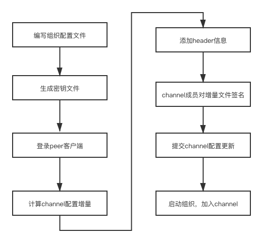

### 添加组织



1. 根据配置文件生成加密材料

   ```yaml
   PeerOrgs:
     # ---------------------------------------------------------------------------
     # Org4
     # ---------------------------------------------------------------------------
     - Name: Org4
       Domain: org4.example.com
       EnableNodeOUs: true
       # Allows for the definition of 1 or more hosts that are created sequentially
       # from a template. By default, this looks like "peer%d" from 0 to Count-1.
       # You may override the number of nodes (Count), the starting index (Start)
       # or the template used to construct the name (Hostname).
       Template:
         Count: 2
       # Count: The number of user accounts _in addition_ to Admin
       Users:
         Count: 1
   ```

2. 获取channel配置区块

3. 计算新旧配置区块的增量(差异)

4. channel中其他成员签名

5. 更新新channel配置

6. 编写docker-compose文件，并启动

7. 进入客户端，

8. 获取channel配置，并提交加入channel请求


```shell
cd org4-artifacts
生成证书
../bin/cryptogen generate --config=./org4-crypto.yaml
生成org4的json字符串
export FABRIC_CFG_PATH=$PWD && ../bin/configtxgen -printOrg Org4MSP > ../channel-artifacts/org4.json
拷贝order证书到org4目录下
cd ../ && cp -r crypto-config/ordererOrganizations org4-artifacts/crypto-config/
docker exec -it cli bash
export ORDERER_CA=/opt/gopath/src/github.com/hyperledger/fabric/peer/crypto/ordererOrganizations/example.com/orderers/orderer0.example.com/msp/tlscacerts/tlsca.example.com-cert.pem  && export CHANNEL_NAME=mychannel

获取mychannel的配置区块
peer channel fetch config config_block.pb -o orderer0.example.com:7050 -c $CHANNEL_NAME --tls --cafile $ORDERER_CA

转为json
configtxlator proto_decode --input config_block.pb --type common.Block | jq .data.data[0].payload.data.config > config.json

将org4加入到此json中
jq -s '.[0] * {"channel_group":{"groups":{"Application":{"groups": {"org4MSP":.[1]}}}}}' config.json ./channel-artifacts/org4.json > modified_config.json

转为pb
configtxlator proto_encode --input config.json --type common.Config --output config.pb

转为pb
configtxlator proto_encode --input modified_config.json --type common.Config --output modified_config.pb

计算pb之间的增量
export CHANNEL_NAME=mychannel
configtxlator compute_update --channel_id $CHANNEL_NAME --original config.pb --updated modified_config.pb --output org4_update.pb

转为json
configtxlator proto_decode --input org4_update.pb --type common.ConfigUpdate | jq . > org4_update.json

加入header信息
echo '{"payload":{"header":{"channel_header":{"channel_id":"mychannel", "type":2}},"data":{"config_update":'$(cat org4_update.json)'}}}' | jq . > org4_update_in_envelope.json

转为pb
configtxlator proto_encode --input org4_update_in_envelope.json --type common.Envelope --output org4_update_in_envelope.pb

org3签名
peer channel signconfigtx -f org4_update_in_envelope.pb

切换到org2签名
export CORE_PEER_LOCALMSPID="Org2MSP" && \
export CORE_PEER_TLS_ROOTCERT_FILE=/opt/gopath/src/github.com/hyperledger/fabric/peer/crypto/peerOrganizations/org2.example.com/peers/peer0.org2.example.com/tls/ca.crt && \
export CORE_PEER_MSPCONFIGPATH=/opt/gopath/src/github.com/hyperledger/fabric/peer/crypto/peerOrganizations/org2.example.com/users/Admin@org2.example.com/msp && \
export CORE_PEER_ADDRESS=peer0.org2.example.com:7051

org2签名
peer channel signconfigtx -f org4_update_in_envelope.pb

切换到org1签名
export CORE_PEER_LOCALMSPID="Org1MSP" &&\
export CORE_PEER_TLS_ROOTCERT_FILE=/opt/gopath/src/github.com/hyperledger/fabric/peer/crypto/peerOrganizations/org1.example.com/peers/peer0.org1.example.com/tls/ca.crt &&\
export CORE_PEER_MSPCONFIGPATH=/opt/gopath/src/github.com/hyperledger/fabric/peer/crypto/peerOrganizations/org1.example.com/users/Admin@org1.example.com/msp &&\
export CORE_PEER_ADDRESS=peer0.org1.example.com:7051

org1签名
peer channel signconfigtx -f org4_update_in_envelope.pb

上传新配置
peer channel update -f org4_update_in_envelope.pb -c mychannel -o orderer0.example.com:7050 --tls --cafile $ORDERER_CA

编写docker-compose文件
docker-compose -f docker-compose-org4.yaml up -d

进入容器
docker exec -it org4cli bash

export ORDERER_CA=/opt/gopath/src/github.com/hyperledger/fabric/peer/crypto/ordererOrganizations/example.com/orderers/orderer0.example.com/msp/tlscacerts/tlsca.example.com-cert.pem && export CHANNEL_NAME=mychannel

获取第0个区块
peer channel fetch 0 mychannel.block -o orderer.example.com:7050 -c $CHANNEL_NAME --tls --cafile $ORDERER_CA

加入到channel里边
peer channel join -b mychannel.block

切换到另一peer
export CORE_PEER_TLS_ROOTCERT_FILE=/opt/gopath/src/github.com/hyperledger/fabric/peer/crypto/peerOrganizations/org4.example.com/peers/peer1.org4.example.com/tls/ca.crt && export CORE_PEER_ADDRESS=peer1.org4.example.com:7051

加入到channel里边
peer channel join -b mychannel.block

配置锚节点（可选）
peer channel fetch config config_block.pb -o orderer.example.com:7050 -c mychannel --tls --cafile $ORDERER_CA

configtxlator proto_decode --input config_block.pb --type common.Block | jq .data.data[0].payload.data.config > config.json

jq '.channel_group.groups.Application.groups.org4MSP.values += {"AnchorPeers":{"mod_policy": "Admins","value":{"anchor_peers": [{"host": "peer0.org4.example.com","port": 11051}]},"version": "0"}}' config.json > modified_anchor_config.json

configtxlator proto_encode --input config.json --type common.Config --output config.pb

configtxlator proto_encode --input modified_anchor_config.json --type common.Config --output modified_anchor_config.pb

configtxlator compute_update --channel_id $CHANNEL_NAME --original config.pb --updated modified_anchor_config.pb --output anchor_update.pb

configtxlator proto_decode --input anchor_update.pb --type common.ConfigUpdate | jq . > anchor_update.json

echo '{"payload":{"header":{"channel_header":{"channel_id":"mychannel", "type":2}},"data":{"config_update":'$(cat anchor_update.json)'}}}' | jq . > anchor_update_in_envelope.json

configtxlator proto_encode --input anchor_update_in_envelope.json --type common.Envelope --output anchor_update_in_envelope.pb

peer channel update -f anchor_update_in_envelope.pb -c mychannel -o orderer.example.com:7050 --tls --cafile $ORDERER_CA
```

