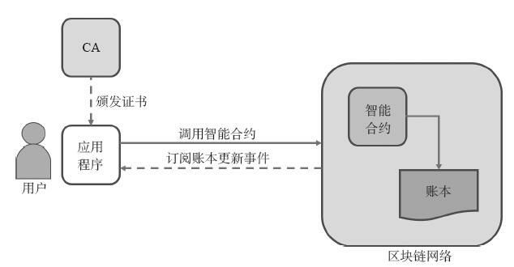

## Fabric Chaincode

ChainCode（链码）是智能合约在Fabric区块链网络的实现形式。分为用户链码和系统链码，通常指的是用户链码。链码是访问账本的基本方法，一般是用Go等高级语言编写的、实现规定接口的代码。上层应用可以通过调用链码来初始化和管理账本的状态。只要有适当的权限，链码之间也可以互相调用。

链码被部署在Fabric网络节点上，运行在隔离沙盒（目前为Docker容器）中，并通过gRPC协议与相应的Peer节点进行交互，以操作分布式账本中的数据。

启动Fabric网络后，可以通过命令行或SDK进行链码操作，验证网络运行是否正常。

chaincode 角色：

应用程序通过向区块链网络发送交易来调用智能合约，从而操作账本中的状态。

总得来说，Fabric的chaincode有以下几个特点：

* chaincode运行在Docker容器中。
* 网络中可以同时运行多个chaincode。
* 具有较高的灵活性，可以使用任意标准编程语言编写chaincode，只需要实现规定接口。
* 不能直接访问账本状态。

### ChainCode的运行方式
在Fabric中交易的处理过程，客户端将提案首先发送到背书节点，背书节点检提案的合法性。如果合法的话，背书节点将通过交易所属的链码临时执行一个交易，并执行背书节点在本地持有的状态副本。

Chaincode应该仅仅被安装于chaincode所有者的背书节点上，链码运行在节点上的沙盒（Docker容器）中，并通过**gRPC协议与相应的Peer节点进行交互**，以使该chaincode逻辑对整个网络的其他成员保密。

ChainCode要在区块链网络中运行，需要经过链码安装和链码实例化两个步骤。

#### 多次安装，一次实例化
如果我们要手动来搭建Fabric网络的话，即通过命令行的形式来进行ChainCode的安装与实例化。我们需要多次install，一次instance。也就是说，对于整个Fabric网络来说，假设有X个背书节点，那么，我们需要给每个背书节点安装ChainCode，但是在整个网络搭建过程中只需要instance ChainCode一次。因为install 针对的是背书节点，instance 针对的是通道。

install 链码的对象是背书节点，主要目的是方便背书节点对运行链码，对交易进行模拟。

instance 链码的对象是channel，主要目的是为了将安装过的链码在指定通道上进行实例化调用，在节点上创建容器启动，并执行初始化操作。实例化的过程中，需要指定背书策略，来确定通道上哪些节点背书的交易才能添加到账本中。

安装的过程其实就是对指定的代码进行编译打包，并把打包好的文件发送到Peer，等待接下来的实例化。

实例化链上代码主要是在Peer所在的机器上对前面安装好的链上代码进行包装，生成对应Channel的Docker镜像和Docker容器。并且在实例化时我们可以指定背书策略。

Chaincode运行在一个受保护的Docker容器当中，与背书节点的运行互相隔离。

### ChainCode的生命周期
Hyperledger Fabric API提供了四个管理chaincode生命周期的命令：

* package
* install
* Instantiate
* Upgrade

在一个区块链网络中，将打包、安装、实例化和升级chaincode的过程作为一种可操作的chaincode生命周期函数进行调用。

1. 打包 Packaging

Chaincode必须先包装在tar文件中，然后才能安装在peer上

2. 安装 install

install的过程会将chaincode的源码以一种被称ChaincodeDeploymentSpec（CDS）的规定格式打包，并把它安装在一个将要运行该chaincode的peer节点上。

在Fabric网络中，我们需要在一个channel上每一个要运行你chaincode的背书节点上安装你的chaincode。

Chaincode应该仅仅被安装于chaincode所有者的背书节点上，以使该chaincode逻辑对整个网络的其他成员保密。其他没有chaincode的成员将无权成为chaincode影响下的交易的认证节点（endorser）。对于认证节点来说，他们不能执行chaincode。不过，他们仍可以验证交易并提交到账本上。

3. 实例化chaincode

实例化ChainCode过程会调用生命周期系统chaincode(LSCC)在一个channel上创建并初始化一段chaincode。实例化过程，会生成对应Channel的Docker镜像和Docker容器。并且在实例化时我们可以指定背书策略。

4. 升级chaincode

chaincode可以通过更改它的版本（SignedCDS的一部分）来随时进行更新。至于SignedCDS的其他部分，比如所有者及实例化策略，都是可选的。不过，chaincode的名称必须一致，否则它会被当做完全不同的另一段chaincode。

在升级之前，chaincode的新版本必须安装在需要它的背书节点上。升级是一个类似于实例化交易的交易，它会将新版本的chaincode与channel绑定。其他与旧版本绑定的channel则仍旧运行旧版本的chaincode。换句话说，升级交易只会一次影响一个提交它的channel。

### 启动过程

Chaincode 首先是一个普通的 Golang 程序，其 main 方法中调用了 shim 层的 Start() 方法。整体启动过程如下图所示。

首先会进行初始化。包括读取默认配置，创建到 Peer 的gRPC 连接，主要包括 `NewChaincodeSupportClient(cc *grpc.ClientConn)` 和 `chaincodeSupportClient.Register(ctx context.Context, opts ...grpc.CallOption)` 两个方法。

初始化完成后，创建有限状态机结构（FSM，github.com/looplab/fsm）。FSM 会根据收到的消息和当前状态来触发状态转移，并执行提前设置的操作。

*Peer 侧也利用了类似的 FSM 结构来管理消息响应。*

之后，利用创建好的 gRPC 连接开始向 Peer 发送第一个 gRPC 消息：ChaincodeMessage_REGISTER，将自身注册到 Peer 上。注册成功后开始消息处理循环，等待接收来自 Peer 的消息以及自身的状态迁移（nextState）消息。

后续过程中，Chaincode 和 Peer 利用 FSM 完成一系列对消息的响应运作，如下所示。

- Peer 收到来自链码容器的 ChaincodeMessage_REGISTER 消息，将其注册到本地的一个 Handler 结构，返回 ChaincodeMessage_REGISTERED 消息发给链码容器。之后更新状态为 established ，并发送 ChaincodeMessage_READY 消息给链码侧，更新状态为 ready。
- 链码侧收到 ChaincodeMessage_REGISTERED 消息后，不进行任何操作，注册成功。更新状态为 established。收到 ChaincodeMessage_READY 消息后更新状态为 ready。
- Peer 侧发出 ChaincodeMessage_INIT 消息给链码容器，准备触发链码侧初始化操作。
- 链码容器收到 ChaincodeMessage_INIT 消息，通过 Handler.handleInit() 方法进行进行初始化。主要包括初始化所需的 ChaincodeStub 结构，以及调用链码代码中的 Init() 方法。初始化成功后，返回 ChaincodeMessage_COMPLETED 消息给 Peer。此时，链码容器进入可被调用（Invoke）状态。
- 链码被调用时，Peer 发出 ChaincodeMessage_TRANSACTION 消息给链码。
- 链码收到 ChaincodeMessage_TRANSACTION 消息，会调用 Invoke() 方法，根据 Invoke 方法中用户实现的逻辑，可以发出包括 ChaincodeMessage_GET_HISTORY_FOR_KEY、ChaincodeMessage_GET_QUERY_RESULT、ChaincodeMessage_GET_STATE、ChaincodeMessage_GET_STATE_BY_RANGE、ChaincodeMessage_QUERY_STATE_CLOSE、ChaincodeMessage_QUERY_STATE_NEXT、ChaincodeMessage_INVOKE_CHAINCODE 等消息给 Peer 侧。Peer 侧收到这些消息，进行相应的处理，并回复 ChaincodeMessage_RESPONSE 消息。最后，链码侧会回复调用完成的消息 ChaincodeMessage_COMPLETE 给 Peer 侧。
- 在上述过程中，Peer 和链码侧还会定期的发送 ChaincodeMessage_KEEPALIVE 消息给对方，以确保彼此在线。